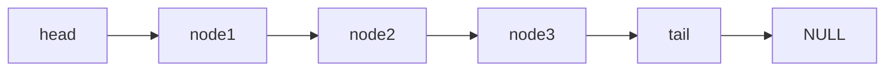
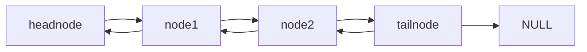
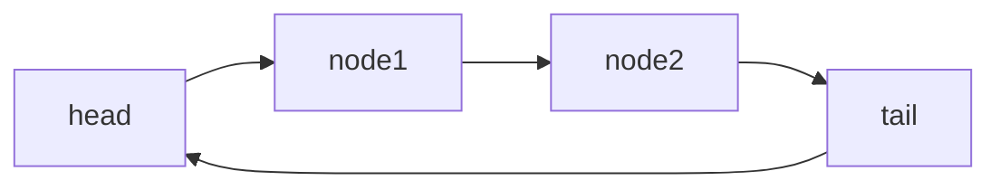
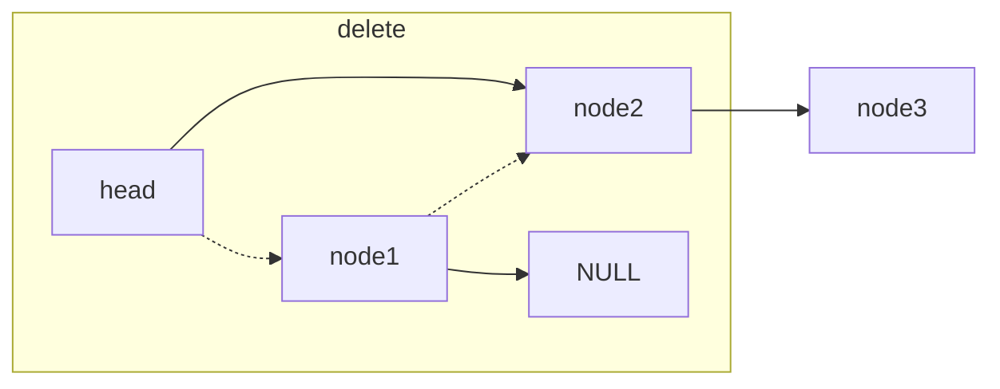
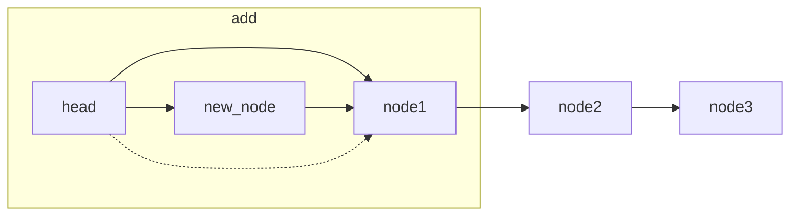
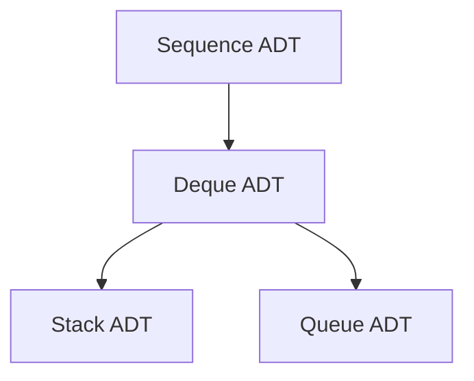
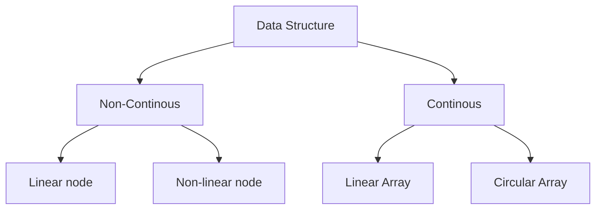
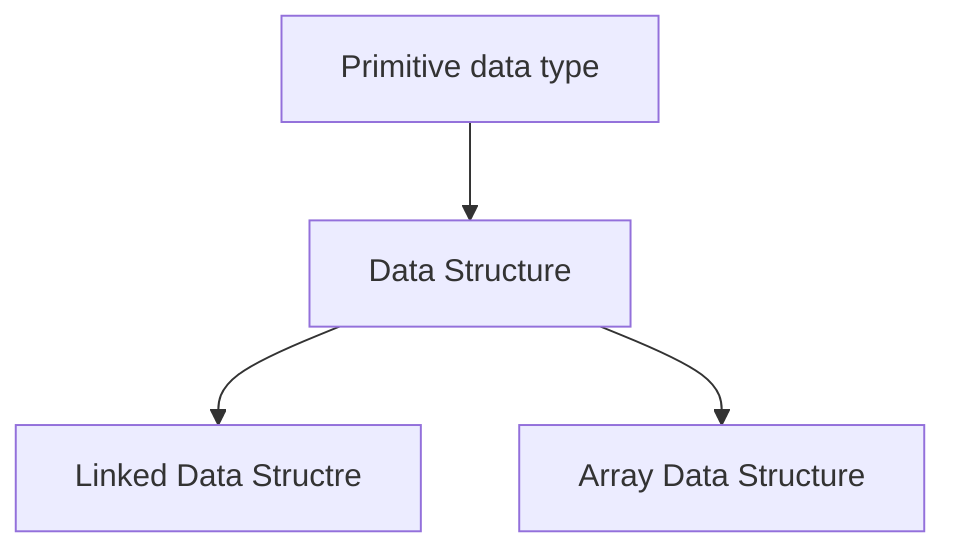

# Sequence Abstract Data Type

---------------------------------

## Introduction


__Some Data Structures and ADTs__ :: 

- array
- static array
- dynamic array
- circular buffer (circular array)
- list (aka Sequence ADT)
- linked list (singly, doubly, circular)
- stack 
- queue
- deque


__Data Structure__ is a way of organizing a collection of _primitive data types_ in a certain order which makes access and mutation easily and effecient. Before studying algorithms in more detail a grasp on data structures is important.

There are two types of data structure : 

1. __Continous data structure__ : 

A continus data structre is stored in continous memeory location so one after the other. An example is an array. 

2. __Non-Continous data structure__ :

A non-continous data strucutre is stored in random memory location so in random memory addresses. An example is node based data structure like linked list or tree. 

Both has their own advantages and disadvantages.

Array has better cache locality and random access which makes it more effecient and faster on modern hardware which has multilevels of cache.

Linked list has better memeory usage and supports dynamic operations 
better at the ends of the list. But a dynamic array also has amortized
constant time O(1) insertion and deletion at the ends. 

__Abstract Data Types__ is an interface which describes what can be done but now how to do it. An example would be __Sequence ADT__ which is a liner collection of objectes(not OOP related) which describes a number of static and dynamic operations such as 
Static Operations :

- Build() 
- len()
- get_at()/set_at()
- iter() 

Dynamic Operations :

- insert/delete_first()
- insert/delete_last()
- insert/delete_at()
- count()

An Abstract data type or a Container provides an __iterator__ object too that can be used to traverse the container. mostly works using a forEach loop (like the looping method in Python). This can be done using __ __iter__()__ magic method. and __next()__ and __iter()__ functions.

To support these operations an __ADT__ can be implemented with two _linear data strucutres_ 

1. Dynamic array (which can be linear or circular)

2. Linked list (doubly linked list because pop() is O(n) in singly linked list)

_Note_

- Container is also called an ADT. 
- list is also know as a sequence ADT 

So the __Sequence ADT__ doesn't tell about how to do it but only what operations has to be done. Both dynamic arrays and linked list has their own advantages and disadvantages. A programmer has to assess which is better for the current problem. In general array data structure is more preffered.

### Types of Sequence ADT

1. __STACK__ : 

A Stack ADT uses Last in First out(FIFO) approach to data insertion and access. Which means data will be inserted at any time but only the most recently inserted data (i.e. the last value aka top or peek) will be deleted first. 
Operations supported by Stack ADT : 

- push(e) : will insert e to the end of the sequence.
- pop() : will delete and return the element at the end of the sequence
- peek() : will return the element at the end of the sequence.
- len() : will return the total number of elements.
- isEmpty() : will return True if empty otherwise False

__Expected time complextiy of operations__

| Operation | Time Complexity |
| --------- | --------------- |
| push(e)   | O(1)            |
| pop()     | O(1)            |

2. __QUEUE__ : 

A Queue ADT uses First in First out approach to data insertion and access. Which means the value that has stayed the longes(i.e. the first value or peek First) will be deleted and accessed first. 

Operations supported by Queue: 

- push(e) : insert e to the end of the queue.
- popleft() : delete and return first element. 
- isempty() : same as Stack.
- peekleft() : return the first element without deleting.
- len() : return the number of elements in the queue.

__Expected time complexity of operations__

| Operations | Time Complexity |
| ---------- | --------------- |
| push(e)    | O(1)            |
| popleft()  | O(1)            |

3. __DEQUE__ : 

A Deque ADT (Pronounced deck) supports insertion/deletion at both ends so its a combination of Stack and Queue. 

Operations supported by Deque : 

- push(e)

- pushleft(e)

- pop()

- popleft()

- isEmpty()

__Expected time complexity of operations__

| Operations  | Time complexity |
| ----------- | --------------- |
| push(e)     | O(1)            |
| pushleft(e) | O(1)            |
| pop()       | O(1)            |
| popleft()   | O(1)            |

## Implementation Details :

__Some Words about Python__

Python provides a dynamic array called __list__. It can be used to implement a Stack ADT and with a little bit of modification it can used as a circular array to implement a Queue ADT and Deque ADT. 

Python doesn't provide a __linked list__ but it can implemented eaily using object reference. 

A deque is not necessary to implement using array as Python provides a builtin Deque ADT in collections module with constant time insertion and deletion at both ends. 

## Dynamic Array

__Dynamic arrays__ unlike static arrays support mutation at runtime. So their size can be changed at run time and objects can be mutated. 
This works by reallocating more memory and then copying all the elements to the new array. 

__nums = [1,2,3,4,5,6,7,8,9,0]__ 

__advantages__ : 

1. Random access at arbitrary location 
2. better memory locality (faster cache performance)

__Disadvantages__ : 

1. Insertion at arbitrary location is O(n) due to resizing

## Linked List

Linked List are non continous data structure i.e. not stored in continous memeory location one aftet the other. So the elements cannot be accessed in constant time like in arrays. Also since they are not stored locally one by one thier cache locality is poor too hence performance decrease. 

Insertion and deletion (Dynamic operations) at both ends are constant time O(1) since all someone has to do is to set first node to NULL and set next pointer of the head node to the second node. Same can be done with the last node(but only in a doubly linked list). 

__note__ : In Python there is no pointer so we can instead store the address of the node object in next data fild of each node. 

__node class in Python 3__ 

```
class node:
    # singly linked list
    def __init__(self,data=None):
        self.data = data
        self.next = None
```

head node can be implemented as 

```
headnode = node()
# since head node contains no data nothing needs to be passed. 

node1 = node(1)

# then store the address of the first node in the headnode as 

headnode.next = node1 
```

Since linked list are recursive data structure they can be travelled 
using recursive function with base case as None value. 

```
def traverse(node):
   if node.next == None:
      return 
   else:
      # do something
      traverse(node.next)
```

Or using a while loop as 

```
def traverse(node):
    current = node.next # this will be the headnode
    while current.next != None:
        # do something 
        current = current.next
```

__Sentinel nodes__ : are nodes that don't have data but are used for traverse and other operations. ex. headnode and tailnode.

__Linked List__ are of 3 types 

- Singly Linked List
- Doubly Linked List
- Circular Linked List

__A Singly Linked List__

In __singly linked list__ each node contains the address of the next node. _headnode_ doesn't contain data only reference to the next location. 

node class for creating node objects : 

```
class node:
    def __init__(self,data=None):
        self.data = data
        self.next = None
```



__A doubly Linked List__

In a __doubly linked list__ each node contains the data and the address of the next and the previous node except for sentinel nodes.

```
class node:
    def __init__(self,data=None):
        self.data = None
        self.next = None
        self.prev = None
```



__Circular Linked List__

__Circular linked list__ is a linked list like singly or doubly but the tail node contains the address of the headnode which gives it a circular structure.



### delete a node



### add a new node



### Circular buffer (aka Circular array)

__Circular buffer__ or circular array is way to wrap around an array so that empty spaces can be used effecienty in a partially filled array.
Instead of using underlaying index position of the array, a seperate
variable can be keep track of the first index position. To find the tail of the array __%__ operator can be used to provide a circular view. 

% operator provide a great way to calculate index positions. 

```
>> 0 % 5 = 0 # top
>> 1 % 5 = 1
>> 2 % 5 = 2
>> 3 % 5 = 3
>> 4 % 5 = 4
>> 5 % 5 = 0 # again at the top
```

Increment of 1 doesn't effect the value until the end is reached when it starts again at the top of the index position. 


__Circulr buffer__ are effecient for implementing an array Queue and Deque.

## In conclusion

### Sequence ADT types



### Data Structure Types



### Fundamental data structure



## Linked Data Structure

A __linked data structure__ is a data structure which consist of a set of data records(_nodes_) linked together and organized by references(_links_ or _pointers_). They are traversed by chasing the pointer refence to the next node unlike arrays that traversed using pointer arithmetic since they are stored in a continous memory location one by one, so 3rd element in the list can be accessed as first + 3 

Linked data structure include __linked list__, __search trees__, __expression trees__, etc. 

Unlike static arrays that had to allocated a fixed size of memory at compile time linked data structure provide a more flexible and dynamic way to deal with data. Since since static arrays doesn't allow mutation(dynamic operations) linked data structure are better in that aspect. 

__Disadvantages include__ : 

Linked data structure may also icur in sunstantial memory allocation overhead and frustrate memory paging and processor caching algorithms (since they have poor locality of reference).

Another problem in linked data structure is the lack of random memory access like arrays. 
